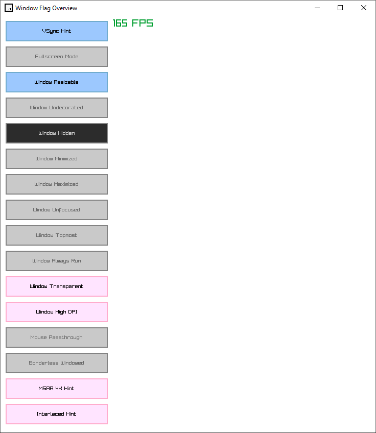

# raylib Window Flag Overview

1. [List of Window Flags](#list-of-window-flags)
2. [Flag Notes](#flag-notes)

This repo holds the source used in my Raylib Window Flags overview video. It was created based on the script I wrote for it. I provide this as an alternative for those more interested in searching / skimming a document than watching and listening to a presenter.

This demo uses Raygui to create an interface to list and control window flags, as well as rini to allow us to set flags to be set on window initialization before *rebooting* the app manually. This makes it easier to test combinations of flags without needing to recompile the app to see the effect.

For convenience a build.bat is included, though if you follow the instructions in my [Raylib with Notepad++ video](https://youtu.be/gj6OXFWYKTA) or simply if you are familiar with gcc it is trivial to build. This command assumes raylib is installed at `C:/raylib/raylib`, gcc is accessible from PATH and that the target is Windows:

>gcc -o flag_demo.exe *.c C:\raylib\raylib\src\raylib.rc.data -s -static -Os -std=c99 -Wall -IC:\raylib\raylib\src -Iexternal -DPLATFORM_DESKTOP -lraylib -lopengl32 -lgdi32 -lwinmm

## List of Window Flags

All relevant flags can be found in the enum definition `ConfigFlags` in `raylib.h`:

- `FLAG_VSYNC_HINT`
- `FLAG_FULLSCREEN_MODE`
- `FLAG_WINDOW_RESIZABLE`
- `FLAG_WINDOW_UNDECORATED`
- `FLAG_WINDOW_HIDDEN`
- `FLAG_WINDOW_MINIMIZED`
- `FLAG_WINDOW_MAXIMIZED`
- `FLAG_WINDOW_UNFOCUSED`
- `FLAG_WINDOW_TOPMOST`
- `FLAG_WINDOW_ALWAYS_RUN`
- `FLAG_WINDOW_TRANSPARENT`
- `FLAG_WINDOW_HIGHDPI`
- `FLAG_WINDOW_MOUSE_PASSTHROUGH`
- `FLAG_BORDERLESS_WINDOWED_MODE`
- `FLAG_MSAA_4X_HINT`
- `FLAG_INTERLACED_HINT`

Some of these flags pertain to the state of the *window* itself:

* `FLAG_WINDOW_RESIZABLE`
* `FLAG_WINDOW_UNDECORATED`
* `FLAG_WINDOW_HIDDEN`
* `FLAG_WINDOW_MINIMIZED`
* `FLAG_WINDOW_MAXIMIZED`
* `FLAG_WINDOW_UNFOCUSED`
* `FLAG_WINDOW_TOPMOST`

The others effect app state and input:

* `FLAG_VSYNC_HINT`
* `FLAG_FULLSCREEN_MODE`
* `FLAG_WINDOW_ALWAYS_RUN`
* `FLAG_WINDOW_TRANSPARENT`
* `FLAG_WINDOW_HIGHDPI`
* `FLAG_WINDOW_MOUSE_PASSTHROUGH`
* `FLAG_BORDERLESS_WINDOWED_MODE`
* `FLAG_MSAA_4X_HINT`
* `FLAG_INTERLACED_HINT`

## Flag Notes

Some flags must be set before `InitWindow` is called, as they cause hard forks in the initialization of the window and as such must be set using `SetConfigFlags(unsigned int)`. Other flags will have no effect if called before the window is created and instead should be called with `SetWindowState(unsigned int)`. At the time of Raylib 5.5, the flags which must be set using SetConfigFlags is restricted to Window Transparency, High DPI, MSAA 4X, and Interlacing.

**VSync** behaves how you'd expect, it enables GLFW's included VSync implementation, which will restrict the refresh rate of the app to the refresh rate of your display. If we enable the FPS counter we can see this in action: because I'm not setting a target FPS with SetTargetFPS, we can see the update rate of the game is obscenely high, but if we enable VSync it drops to 165, the refresh rate of my monitor. It's important to note that if I move the window to my second monitor not pictured here, which has a maximum refresh rate of 60, the VSync target does not change. Using SetWindowMonitor to deliberately choose the window and even use it from the start does not change this outcome, so it's likely hardcoded somewhere deeper within Raylib or even GLFW to assume your primary monitor is the monitor to get VSync information from. If you need different behavior than this, you will need to modify the source to suit your needs.

**Fullscreen Mode** toggles an exclusive fullscreen which will automatically scale the output of the app to fit the smallest dimension of your screen, and use black bars to avoid skewing the aspect ratio of the original output. If you're rendering at a considerably smaller resolution than the resolution of the display, some clear blurring and distortion will be present. This is generally unavoidable without careful custom logic: if you're expecting to be able to set a flag and have your raylib game be fully responsive to resizing, that's not possible. However if you consider scalability from the start of the game's development it is possible to have very responsive resizing. This is a much larger topic for a later discussion. The gist of what you may want to consider for now, is check the size of the monitor with the `GetCurrentMonitor`, `GetMonitorWidth` and `GetMonitorHeight` functions, adjust the screen with `SetWindowSize`, and *then* use this Toggle Fullscreen. 

It's worth noting that the `ToggleFullscreen` function found in `raylib.h` has the same effect as calling this flag (indeed, setting this flag calls the function.) The same can be said about the **Borderless Window** flag, it calls `ToggleBorderlessWindowed` which sets the underlying flag. If you've played many games which support both types of Fullscreen you've likely seen some odd behavior when comparing the different modes across different games, but I bet the Raylib implementation has something else you haven't seen: using Borderless Windowed here enables Topmost and Undecorated. Undecorated sure, that makes perfect sense, it's how we achieve that borderless look, but Topmost is a bit unusual. Ordinarily, it is possible to float other windows across a Borderless Window game, at least many of the ones I've played. In this case it may have been done to prevent the Taskbar from showing above the game, but in my testing I can enable Borderless Window, disable Topmost, and even pressing the windows key does not cause my Taskbar to appear over the window. Just some oddities to look out for.

Next we have some basic window control flags. **Resizable**, **Undecorated**, **Minimized**, **Maximized**, **Unfocused**, and **Topmost**. I'll bet you can guess what each does: **Resizable** makes the window resizable by dragging the edges or corners with the mouse. Note that when the drag operation is done, SetWindowSize is called to update the screen size, so the stretched preview doesn't persist. **Undecorated** removes the title bar and prevents most window control (including simply moving it) If your game uses this, it is very wise to offer the ability to re-enable it or to create a custom title bar of sorts that will still allow the user to reposition the window. It's worth noting here that WIN + SHIFT + Left / Right will still jump the window from one monitor to another.

**Minimized and Maximized** if triggered manually will do as they say, they may not be as common a flag to manually trigger but rather more likely a flag to check with `IsWindowState` to find out what state the window is in. **Unfocused** is much of the same.

**Window Topmost** as we already discovered will force the window to be "Always On Top". I use Powertoys, so I have a keyboard shortcut to force this state on any window. I notice that when using the hotkey to enable this functionality, it adds an outline to the window that the flag does not. This hotkey *does* seem to control the same thing as the flag, it's just that the flag is not notified of the change, so using the hotkey to *disable* or *enable* Topmost does not update the color of the button. Please note the implementation of these buttons is always getting the most recent WindowState value, so the inner flag really isn't being set by this hotkey. Very interesting!

To speak more on **Window Hidden**, I notice that we lose focus of the now hidden window, so aside from possibly some global-hotkey system or alternative input handling solution, the app is basically lost unless you have a timer that will automatically un-hide the window, or you do some kind of signal handling thing to be able to send a signal to the process to call it back. I'm really not sure what this will be good for but I'm sure it will be the killer app for somebody!

**Window Always Run** prevents the game from stopping when minimized. It's easiest to see this effect on something playing music: if we don't set this flag minimizing the window halts the music. Setting the flag allows the music to play even when the window is minimized, and indeed the rest of the game's logic will also run. Possibly very important for any of you planning to make an Idle game!

Speaking of Idle games, I want to look at some of the reboot-required flags, starting with **Window Transparent**. This is the one that has the clearest utility for me. I've set the `ClearBackground` call in my drawing block to conditionally use White when the window is in the normal state, and `BLANK` when Transparency is enabled. Let's reboot the window with Window Transparency enabled! Now any parts of the window where I'm not drawing something, we can see through to my desktop. This can work really well when paired with **Mouse Passthrough** to allow us to draw widgets to different parts of the screen, and still allow the user to interact with most of their desktop. Note that the Window Passthrough flag is not clever enough to automatically determine whether the pixel your mouse is on is something drawn by the window or just the desktop, and you wouldn't necessarily want to require pixel perfect accuracy anyway. You will need to write some clever handling to achieve that effect. With my setup, I can use Escape to cancel the Mouse Passthrough and regain control of the app. It's also worth noting that when writing this video, the "transparent" background rendered as solid black. I had to update my graphics driver to see the proper effect. When I came back to this project to *record this video*, the same thing happened. I ran *the very same graphics driver I already had installed, the same installer I downloaded the other day* and it fixed it. Perhaps I need to do some driver cleanup with DDU, but I needed to mention this because even on the same platform, your mileage may vary. Window transparency is an unusual feature so graphics driver version can effect it. If you intend to design a game around this, it's best to offer the user the ability to replace the transparent background with an optional solid color.

**HighDPI mode** indicates the window should consider the Scaling Settings of your display. Mine is set to 100%, so there's no notable effect. But for instance if you're using a 4k display it's not totally uncommon to run a 125% scale in Display Settings, and in that case this will change the window to appear 25% larger.

**MSAA 4X Hint** attempts to enable 4X Multi-Sampling Anti-Aliasing, which is a common render technique used to smooth out jagged edges, particularly diagonal lines. It's difficult to demo, especially in 2D, without a full-fledged game project to test in. I would like to revisit this particular option much later when we have sample 3D projects to toy around with. Many of the 3D examples provided in the Raylib source and on Raylib.com are seen to use this flag, and unless you are going for a particular jaggy aesthetic it is likely something you want enabled.

**Interlaced Mode** is currently only relevant on the Raspberry Pi backend. For certain embedded displays, interlaced video will be necessary, so this is one of those "if you know what you're doing" flags. Feel free to set it and unset it to your hearts content on any of the other desktop / web / mobile backends, it does nothing.

## Conclusion

I mentioned at the start that there are two types of flag, ones that are considered Config Flags and must be set before window initialization, and the others considered Window State which can be set *after* the window is initialized. They each use their own function, and attempting to use the wrong function should result in a warning in the log. Even worse, the thing you expect to happen won't happen! I recently submitted a PR to improve the logging in these cases, but Ray suggests this whole two-sided flag system may need to be adjusted. If that happens I'll have a pinned comment to an addendum for this!

As for the demo itself, I recommend you pull this repo or recreate my setup locally to thoroughly test any of these flags that may be relevant for your target platform.
